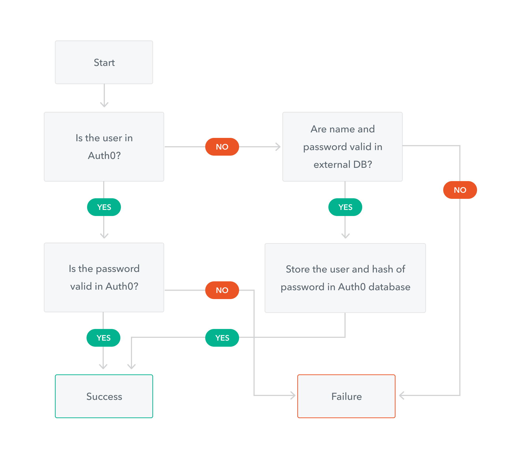

## Voice over dialog
Automatic or lazy migration describes the process by which users are moved to Auth0 upon their first successful authentication after this integration is configured and implemented.  There are two primary benefits of this type of user migration:
1. Users are not asked to reset their passwords after having been migrated
2. No down time is necessary

In all other respects, the process is invisible to users and is therefore completely seamless.

Setting up automatic migration starts with the use of a [custom database connection](https://auth0.com/docs/connections/database/custom-db) in Auth0.  As users authenticate, the following process takes place:
- Auth0 authenticates already migrated users against the Auth0 database
- If the user has not been migrated, Auth0 executes a custom login script which interacts with the legacy system / database, and upon successful log in, adds the user to the Auth0 database
  - Subsequent logins result in the user's credentials being retrieved from Auth0, NOT from the legacy system / database
- Note: new user signups are automatically added to the Auth0 database

Let's look at a diagram that describes this approach:
### Decision diagram
This [decision diagram in Auth0 documentation](https://auth0.com/docs/users/import-and-export-users) highlights the yes/no decisions that determine what action(s) will take place in Auth0 and/or the legacy authentication system during automatic migration:

#### Diagram points to highlight:
- The initial decision is: "is the user already in Auth0's database?"
  - if yes, then either the user is new (signed up after Automatic Migration was configured & implemented), or has already been migrated
  - if no, then Auth0 reaches out to the legacy system / store to determine if the supplied credentials are valid
- When a not-yet-migrated user successfully authenticates against the legacy system, the user's meta-data (e.g. username or email address or phone number, potentially additional profile data) and hashed password are stored in Auth0's database
  - At this point, the user is stored and managed in Auth0, and no further interactions with the legacy system are required for the user

Over time all new users, and all active existing users who can successfully authenticate against the legacy system, are eventually added to and managed in Auth0.

### Configuring Automatic Migration via the Auth0 web console
TODO: finish -> borrow points from [this page of Auth0 documentation](https://auth0.com/docs/users/configure-automatic-migration-from-your-database)

### Data flow diagram
TODO: new DFD that highlights the interactions between auth0 and a legacy auth system as a user is seamlessly / lazily migrated

### Security
It is typically considered a non-secure practice to directly expose a database connection to the Internet.  Therefore, it is recommended to utilize an API (e.g. a REST API) in front of the legacy system's database for access by the Auth0 Automatic Migration scripts.  This API can then be protected by utilizing one of several standard API security practices such as bearer token or basic auth, over a secure (HTTPS) Internet connection.

### Custom Database Action Script exection best practices
TODO: finish -> borrow points from [this page of Auth0 documentation](https://auth0.com/docs/best-practices/custom-database-connections-scripts/execution)

### Lab notes
TODO: transition to the lab, and how it will solidify the concepts covered in the narration

Extra notes (eventually clean up / get rid of)
- Lazy load video script goes here
    - what is it?
    - why & when to use it?
      - why: no down time for users (seamless experience)
      - why: no need for users to reset their password (seamless)
      - why: conceptually simple to implement and test
      - when: bulk is not an option because user passwords cannot be exported
      - when: bulk is not an option due to the potential need for legacy system down-time
    - why not & when not to use it?
      - why not: <finish>

- Asset ideas:
  - Data flow diagram (C4 level 4 - DFD) depicting interactions of system actors in a typical lazy load migration implementation
    - relate to the Lab